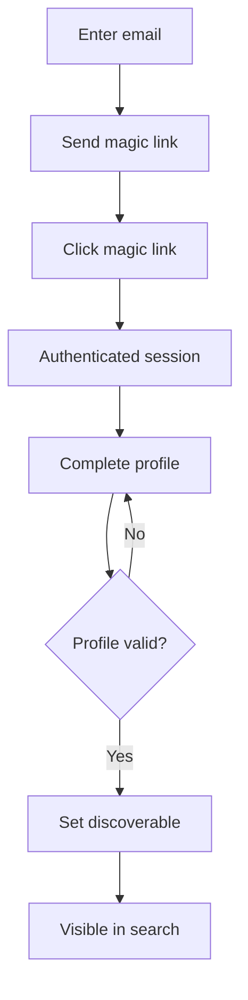
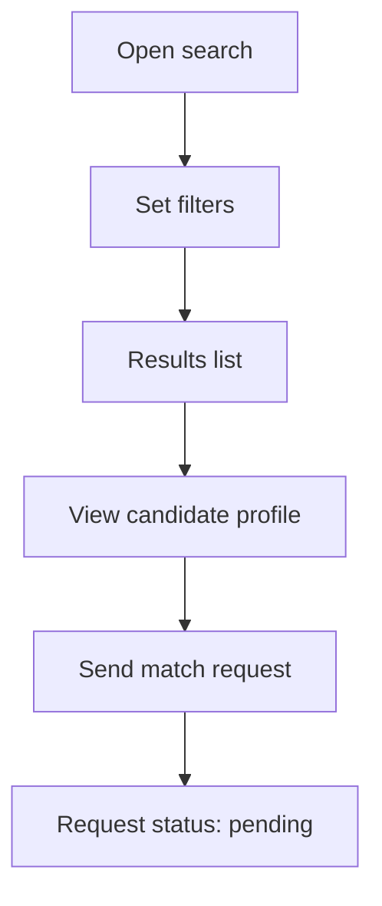
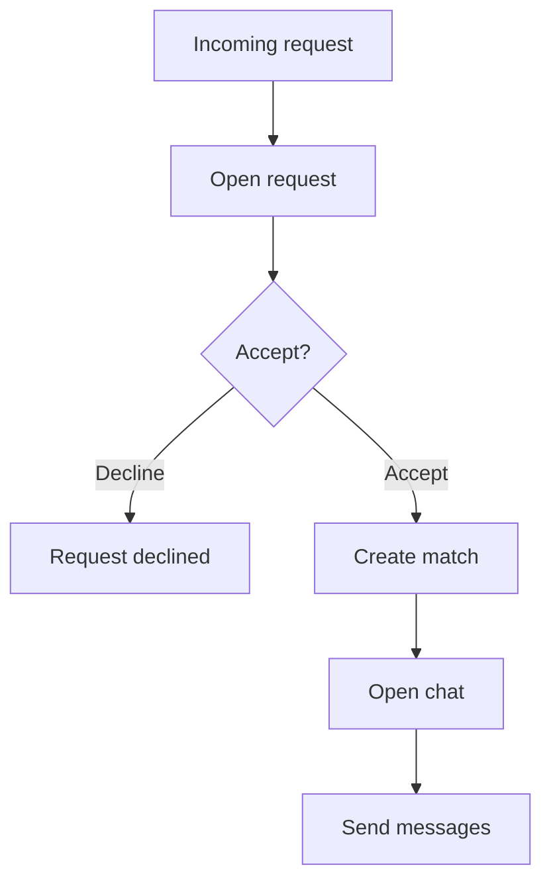
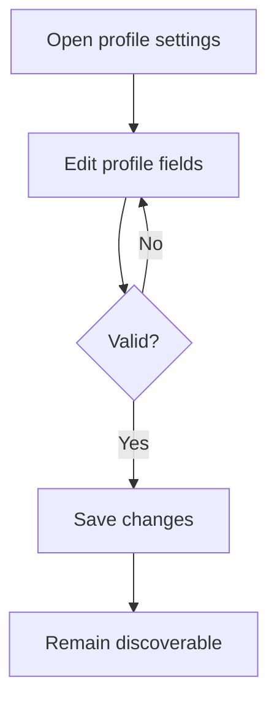
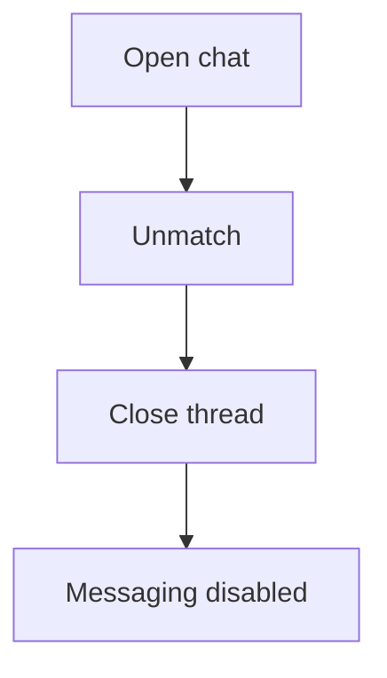

# Amiglot — Production Specification (User Stories & Paths)

## 1. User Stories (Detailed)
### Onboarding & Profile
- As a new learner, I can sign up via a magic link so I can get into the product without passwords.
- As a new learner, I can create a profile with a unique handle (stored without `@`; UI adds the `@` prefix), birth year + month, country, and languages so I can be discoverable by partners.
- As a learner, I must set at least one native language so my profile can be created; additional languages and levels can be added later.
- As a learner with only one native language set, I cannot search for others or be discoverable until more language data is added.
- As a learner, I can edit my profile fields (except email) to keep my info current.
- As a learner, I can manage my availability (days/time blocks + timezone) so the system can surface good overlaps.

**Availability definition**
- Users select availability in their **local timezone** (days/time blocks).
- System stores **local time + timezone** per slot; matching converts to UTC for specific dates at query time (DST-safe).
- If a user does not set availability, the UI can **suggest a default** for their timezone, but nothing is stored until the user saves.

### Discovery & Matching
- As a learner, I can add languages with a proficiency level (and an optional short description) so others understand my ability.
- As a learner, I can only be matched when there is a **mutual exchange**: each person wants to learn a language the other can teach.
- As a learner, I can only be matched when there is at least **one shared bridge language** (both users ≥ Intermediate) so we can coordinate.
- As a learner, I can search and filter candidates by language pair, level, availability overlap, age (derived), and country so I can find compatible partners.
- As a learner, I can view a candidate profile and send a match request with a short intro note.
- As a learner, I can accept or decline incoming match requests so I control who can chat with me.
- As a learner, I can see match request status (pending/accepted/declined) so I know what to expect.

### Matching Rules (V1)
**Internal buckets (derived from levels)**
- **Teachable (`L_teach`)**: level ≥ 4 (Advanced/Native)
- **Learnable (`L_target`)**: explicitly selected to practice
- **Bridgeable (`L_bridge`)**: level ≥ 3 (Intermediate)

**Checks (all must pass)**
1) **Supply check** — User B has a language User A wants at **level ≥ 4**.
2) **Demand check** — User A has a language User B wants at **level ≥ 4**.
3) **Bridge check** — Users share at least one common language where **both** are **level ≥ 3**.

**Scope notes**
- V1 is mutual‑only (no one‑sided “just chat” matches).
- For now, we only allow **strong matches** (strict supply/demand thresholds). We may relax these thresholds later.
- Group matching and multi‑party exchanges are out of scope for V1.

### Chat
- As a matched learner, I can start a 1:1 text chat so I can practice with my partner.
- As a learner, I can see message delivery timestamps so I can track the conversation.
- As a learner, I can end a chat (unmatch) to stop further messaging.

### Safety & Compliance
- As a learner, I can report or block another user to protect my experience (workflow may be minimal in V1).
- As an admin, I can view a minimal dashboard (new users, matches, and message counts) to monitor usage.

## 2. User Action Paths
### 2.1 Sign up → Profile → Visible in Discovery
**Path**
1. User enters email → requests magic link.
2. User clicks magic link → authenticated session created.
3. User completes profile (handle, native language, country, birth year/month, availability; target languages/levels may be added later).
4. System validates profile and sets status to “discoverable” only if minimum language data is sufficient.
5. User appears in search results when discoverable.

**Mermaid**

### 2.2 Search → View Profile → Send Match Request
**Path**
1. User opens Search.
2. User sets filters (language pair, level, availability overlap, age, country).
3. System returns candidates.
4. User opens a candidate profile.
5. User sends match request with intro note.
6. System creates “pending” request.

**Mermaid**

### 2.3 Incoming Request → Accept → Start Chat
**Path**
1. User receives notification of a match request.
2. User opens request and reads intro.
3. User accepts request.
4. System creates a match and opens chat thread.
5. Both users can send messages.

**Mermaid**

### 2.4 Edit Profile → Keep Discoverable
**Path**
1. User opens profile settings.
2. User edits profile fields (not email).
3. System validates changes (handle uniqueness, at least one native language).
4. Profile remains discoverable.

**Mermaid**

### 2.5 Unmatch → Close Chat
**Path**
1. User opens a chat.
2. User selects “Unmatch”.
3. System closes the thread and prevents further messages.

**Mermaid**

