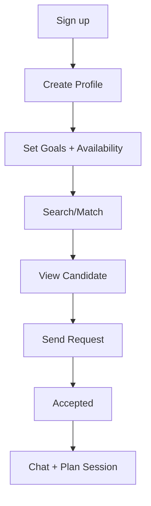

# Amiglot — Production Definition (Phase 1)

## Personas
1) **Serious Learner** — wants consistent practice, structured goals, prefers matched levels.
2) **Casual Partner** — wants light conversation practice, flexible schedule.

> Note: **Usage intent is not a required profile choice at signup**. People can explore serious vs. casual matches after registration.
> **Helper/Tutor** intent is out of scope for V1; consider it as a future profile attribute.

## Top 3 user journeys
A) **Onboarding → Profile → Language goals → Availability → (Optional preferences) → Start searching**
B) **Discover/match → Browse candidates → Send request → Accept → Open chat**
C) **Chat → Schedule practice → Keep notes → Continue/adjust**

## V1 must‑have
- Auth/session: **magic link** (dev mode: if `ENV=dev` and no sender, generate login link locally)
- Profile: native + target languages, level, goals, time zone, availability
- Search/match: filter by language pair, level, availability overlap
- Match request + accept/decline
- Basic 1:1 messaging (text)
- Minimal admin view/dashboard (non‑reporting)

## Explicitly out‑of‑scope (V1)
- Payments or premium tiers
- Video/voice calls
- Group lessons or communities
- AI tutor features
- Full scheduling/Calendar sync
- Reporting/abuse workflows (no report in V1)

## Happy path (Mermaid)

## Additional confirmed requirements
- **Day‑1 multi‑language support** for all UI and user‑facing API messages (user‑selected language).
- **Profile minimums**:
  - Email (read‑only after signup)
  - Unique user handle (letters/numbers only, case‑insensitive; stored with `@` prefix, e.g., `@arturo`)
  - Languages list with levels; **at least one native language** required on registration
- **Profile edit rules**:
  - Email is read‑only after signup
  - Users can have only **one handle at a time**; handle changes must pick a handle **not currently in use by another user**
  - If a user changes handles, their old handle becomes available for others
  - Internal fixed user ID is used for interactions; `@username` is just the display label
  - Other fields editable as long as the user still has **at least one native language**
- **Additional profile fields**:
  - Birth year + month only (no date); compute age on the fly when needed
  - Store **country code**, display country name via standard mapping
  - **Avoid gender**
- **Messaging limits (anti‑spam)**:
  - Limit pre‑accept messages (N messages)
  - Daily message cap per user
  - Make both configurable

## Search filters (V1)
- Age (derived from birth year/month)
- Country (stored as country code)
- Avoid gender

## Open questions (for later phases)
- Any hard filters beyond age/country to include or avoid.
